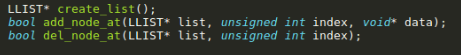
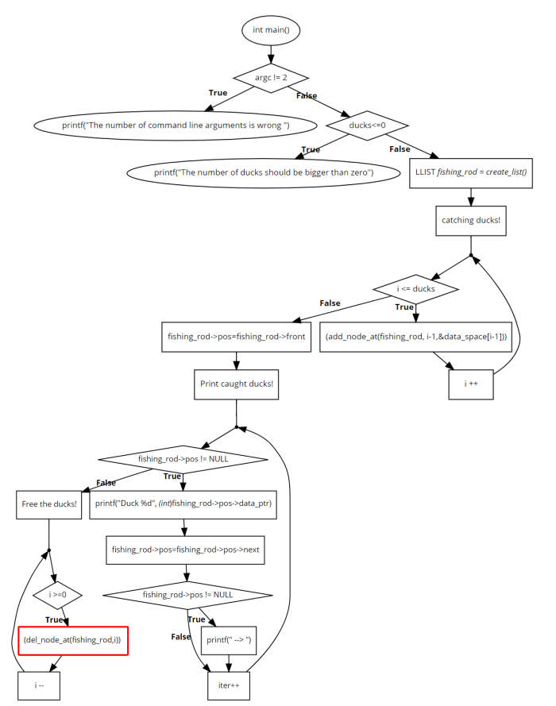
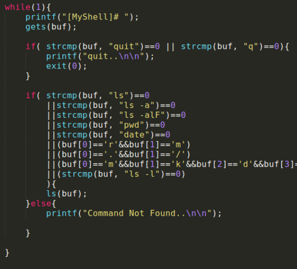
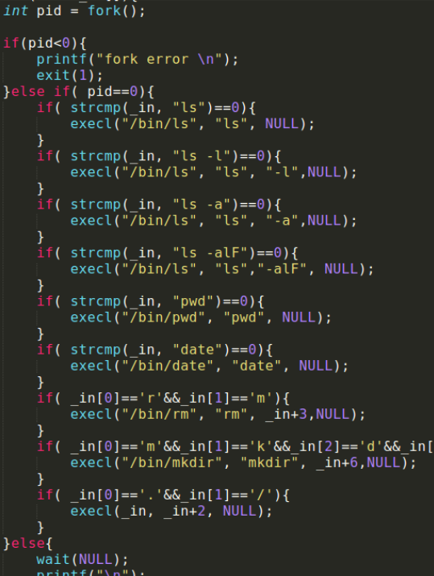
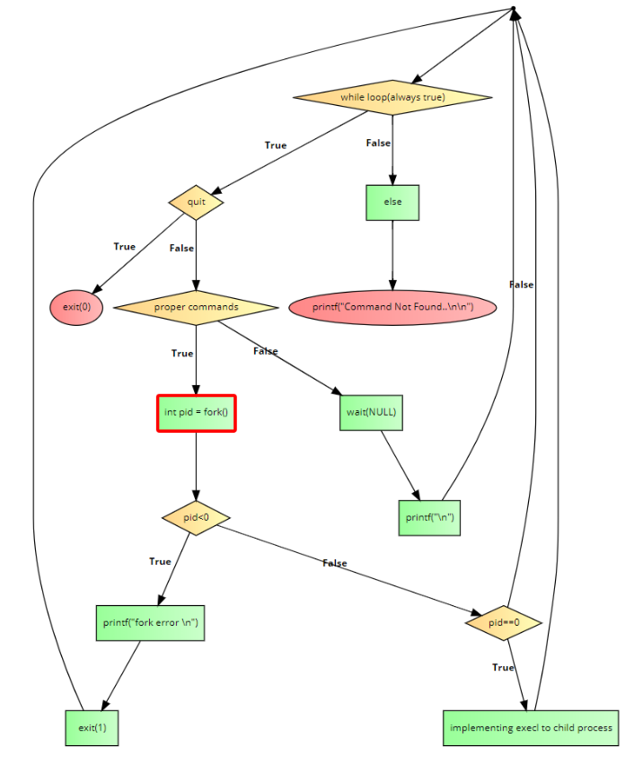

# OS codes

## Table of Contents

- [hw1](#hw1)
  - [개요](#개요)
  - [함수 설명](#함수-설명)

- [hw2](#hw2)
  - [개요](#개요)
  - [함수 설명](#함수-설명)

- [hw3](#hw3)
  - [개요](#개요)
  - [함수 설명](#함수-설명)

- [hw4](#hw4)
  - [개요](#개요)
  - [함수 설명](#함수-설명)


---
# hw1
## 개요
오리를 포획하고 풀어주는 상황을 단순 배열이 아닌 Linked list에 대입하여, 오리 포획은 Linked list에 새로운 노드가 삽입 되는 상황으로, 오리 방생은 Liked list의 노드를 free 시키는 상황으로 각각 대응시켜서 c 코드를 작성해 보았습니다. main 함수의 인자로 전달 받은 수 만큼의 오리를 잡아 출력했습니다. 잡은 오리들은 마지막에 for loop를 돌면서 한 마리씩 모두 풀어줍니다. 오리를 잡을 때, 다 잡고난 뒤, 풀어줄 때의 과정을 확인할 수 있도록 진행 상황을 print해주었습니다.

## 함수 설명

사용한 함수는 다음과 같습니다.


   

위 함수들 말고 <stdlib.h>를 include하여 사용한 atoi() 함수도 있습니다.

 create_list 함수는 empty linked list를 생성해주는 함수입니다. malloc을 이용하여 llist를 할당해주고, llist의 front, rear, pos는 NULL로 설정하고 count는 0으로 설정해 줍니다. 그렇게 malloc으로 생성하고 각종 값들이 설정된 list를 return 합니다.

 add_node_at 함수는 원하는 리스트의 정해진 index 값에 원하는 데이터의 포인터를 data_ptr로 갖고있는 노드를 삽입하는 함수입니다. 이 함수와 del_node_at 함수는 bool data type으로 설정하여, 삽입이나 삭제가 올바르게 일어났는지 알려주는 역할도 하게 했습니다. 예를들어, 삽입하고자하는 인덱스가 list의 노드갯수보다 클경우에는 false를 리턴하고 malloc을 이용하여 삽입하고자 하는 새로운 노드를 생성할 때, 생성이 실패하면 false를 리턴합니다. 그리고 또한 리스트의 카운트가 0일 때 즉, 빈 리스트에 새로운 노드가 들어갈때와 그렇지 않을때의 경우를 나누어 코딩했고, 그렇지 않을 때의 경우에는 index가 0일 때와 index가 리스트의 마지막 노드를 가르킬 때와 그렇지 않을 때의 경우로 나누어서 코딩했습니다.

 del_node_at은 리스트와 인덱스를 argument로 받아서, 해당 인덱스에 있는 노드를 삭제해주는 역할을 합니다(오리를 free 시킬 때 사용했습니다). del_node_at도 위에서 설명한 add_node_at 함수와 비슷한 맥락으로 코딩이 되어있는데, 리스트가 빈리스트라면 바로 false를 반환하는 점과, pos 이외의  NODE*타입의 주솟값을 담고 있는 pre를 이용해서 pos가 가리키는 값을 free 시킬 때 필요한 순간에 필요한 값에 access할 수 있도록 해준다는 차이점이 있습니다.

 atoi()함수를 이용해 argv[1]에서 받은 string을 int 자료형으로 변환해주는데에 이용합니다.


## flow chart

 
 # hw2
## 개요
child process를 생성할 수 있는 fork() 함수와 리눅스에서 새로운 프로세스를 실행시키는 exec 계열의 함수를 사용하여 자신만의 shell 프로그램을 작성해 보았습니다. main함수의 while loop가 메인 프로세스 quit 되기 전까지 반복하여 돌면서 입력을 받고, 받은 명령어가 제가 구현한 함수 내에서 처리할 수 있는 범위 내에서 처리되는 shell 프로그램입니다. 저의 myshell 코드는 ls, ls-l, ls –a, ls –alF, pwd, date, rm, mkdir, 현재 디렉토리 내 실행파일 실행의 작업을 할 수 있습니다.

## 함수 설명
   정의한 함수는 main과 ls입니다. main 함수에서는 무한 while 루프가 돌면서 입력을 받습니다(quit 전까지). 아래는 메인함수 내의 while loop입니다.

 

입력을 받게되면 아래의 세가지 경우로 나누어 처리합니다. 
 
1. quit
2. ls함수가 처리할 수 있는 부분
3. command not found

  여기서 제가 정의한 ls 함수(이름만 ls임)는 <ls, ls-l, ls –a, ls –alF, pwd, date, rm, mkdir, 현재 디렉토리 내 실행파일 실행> 의 명령어가 입력되었을 때 처리할 수 있습니다. ls 함수는 fork() 함수를 사용하여 child process를 fork 시켜, child process에 exec 계열의 함수를 사용하여  새로운 프로세스가 현재의 프로세스 이미지를 덮어씌우는 방식으로 shell 프로그램을 구현하는데, 이때 적용된 fork()함수는 아래와 같습니다.




  먼저, int pid = fork(); 는 fork함수를 실행시키고, 그 return 값을 pid라는 변수에 할당하는 역할을 합니다. fork 함수가 실행되면 자식 프로세스를 생성하고, 생성된 child process 는 parent process의 정보들을 대부분 물려받습니다. fork함수의 리턴 값은 child process와 parent process에 따라서 달라지는데, parent process에게는 생성된 child process의 ID가 return되고, child process에게는 0의 값이 return 됩니다. 따라서 이를 이용하여, if문을 적용해 경우를 나누어 주었습니다. 

  위처럼 fork 함수에 의해 return된 process id를 이용하여 생성된 프로세스가 child process인지 parent process인지 구별해주고, 적절한 작업을 exec 계열의 함수를 이용하여 shell 프로그래밍의 구현이 가능하도록 해주었습니다. 
  위의 코드에서 execl의 사용 예 또한 볼 수가 있습니다. execl 함수는 실행할 파일의 경로와 인자들을 argument로 넘겨주어 사용하는데, 마지막에는 마치 문자열처럼 NULL을 넘겨주어 끝이라는 것을 알려줍니다. 즉, 첫 번 째의 인자로는 실행할 파일의 경로, 두 번째에서부터 n 번째까지는 넘겨주어야할 모든 인자들을 띄어쓰기 단위로 넘겨주고, 마지막에는 NULL을 넘겨주는 것입니다. 위의 코드를 이용하여 예를 들자면, ls –alF의 경우, ls 실행파일의 경로인 /bin/ls를 첫 번째 아규먼트로 넘겨주고, ls와 –alF를 각각 아규먼트로 넘겨주고, NULL을 넘겨주어 해당 명령어를 실행합니다. rm과 ./실행파일을 제외한 나머지 명령어들도 위와 비슷한 방식으로 모두 해결이 가능합니다.

  rm과 ./실행파일은 shell에 입력하는 명령어가 고정된 것이아니라, 파일 이름에 따라서 바뀌는 부분이 있기 때문에, 이를 처리해주기 위하여 입력받은 문자열에 rm이 첫 번째 두 캐릭터라면 뒤의 띄어쓰기 이후의 문자열을 파일이름으로 인식하여 execl의 매개변수로 넘겨주는 방식으로 여러 가지 파일이름에 대응할 수 있도록 했습니다. ./ 실행파일의 경우, 실행파일의 경로는 현 디렉토리의 실행파일임으로, 이것도 rm의 방식과 비슷하게, 문자열의 앞머리에 ./가 포함되어 있을 경우, 입력문자열 자체를 경로로 passing하고, 실행할 파일은 ./를 제외한 나머지 문자열로 execl함수에 넘겨주는 방식으로 처리했습니다.

## flow chart

 

 # hw3
## 개요
  여러 쓰레드를 생성하고 부모 프로세스의 전역변수에 접근하여 충돌이 일어나는지 확인하는 프로그램을 작성하였습니다. pthread library를 이용하였습니다. quick sort를 이용하면 추가점수가 있다는 공지가 있어서, 제 나름대로 quick sort에 관하여 찾아보고 알고리즘을 이해한 뒤, 어떻게하면 세마포어나 뮤택스를 사용하지 않았을 때 오류가 나는것이고, 왜 나는 것인지 고민해보고 제가 생각하는 정답의 코드를 작성하였습니다. quick sort가 quick인 이유는 pivot을 기준으로 나눈 subarray를 병렬적으로 처리하게될 수 있다면 serial 하게 쭉 sorting하는 것 보다 빨라질 수도 있어서 그럴 것이라고 제 나름대로 가정하고, thread를 생성할 때에도, 이 원리를 적용하기 위해서 생성한 한 개의 생성된 thread가 재귀적으로 다른 thread들을 최대 두 개 생성하여 병렬적으로 처리가 가능하고 이것이 마치 binary tree처럼 0개또는 1개 또는 2개의 가지를 쳐서 층이 깊어지면 깊어질수록 더 많은 양이 한꺼번에 sorting이 수행될 수 있도록 프로그래밍 했습니다.

## 함수 설명

```c
typedef struct{
	int l;
	int r;
}LR;
```

함수에 대해 설명하기 이전에, 위코드는 pthread_create가 받을 두 개의 매개변수를 struct를 이용해 한번 감싸놓은 형태의 코드입니다. quicksort의 특성상, 시작점과 끝점이 필요한데, 이를 left의 l과 right의 r로 표현하였습니다. 해당 값들은 index가 되어야 하기 때문에 int type을 가집니다. 
해
```c
void test(){for(int i = 0; i < length-1; ++i)if(data[i]>data[i+1])printf("err, %d\n",i);else printf("0");}
void initialize_array(){
	for(int i = 0; i < length; ++i) data[i] = rand() % 300 + 1;}
```
 위 코드는 배열이 다 sorting 된 후, sorting이 제대로 되었는지 확인하기 위한 test() 함수와, 전역변수 배열인 data array를 random한 값으로 initialize 하기 위한 코드입니다. test()함수는 length-1의 값까지, 현재 인덱스의 값이 다음 인덱스의 값보다 작거나 같은지 확인하는 방식으로 for loop를 돌면서, 확인을 합니다. initialize_array()는 1부터 300 사이의 random한 값을 data array에 총 길이만큼 loop를 돌면서 assign해주는 역할을 합니다.

```c
void print_array(){
	for(int i = 0; i < length; ++i)printf("%d  ",data[i]);}
```
 위 코드는 for loop를 돌면서 data array를 출력해주는 함수입니다.

```c
void *quick_sort( void * a){
	LR * tmp = (LR*) a;


	int left = tmp->l;
	int right = tmp->r;
	int pivot = data[(tmp->l+tmp->r)/2];

	do{
		while(data[left] < pivot) left++;
            while(data[right] > pivot) right--;
            if(left <= right){    
            
                int temp = data[left];
                data[left] = data[right];
                data[right] = temp;
               
                left++;
                right--;
		}
	}while(left <= right);       
        if(tmp->l < right) {pthread_mutex_lock( &mutex );
         k +=1;
         lr[k].l = tmp->l; 
         lr[k].r = right;pthread_mutex_unlock( &mutex );
         pthread_create(&id[k], NULL, quick_sort, (void*)&lr[k]);}

        if(tmp->r > left) {pthread_mutex_lock( &mutex );
         k +=1;
         lr[k].l = left; 
         lr[k].r = tmp->r;pthread_mutex_unlock( &mutex );
         pthread_create(&id[k], NULL, quick_sort, (void*)&lr[k]);}
}
```
위 함수는 quick_sort 함수입니다. 일단, pthread_create에서 사용하기 용이하도록, void* type의 함수이고, 매개변수 또한 void*의 type을 갖습니다. 매개변수로는 quick sort 특성상 처음 index와 끝 index, 두 개의 매개변수들이 필요하기 때문에, pthread_create에서 받아드리기 위하여 강의자료를 참고해 struct형태의 매개변수를 받아, 그것을 풀어서 사용하는 형태로 코드를 구현했습니다. 위 함수는 struct 속의 left와 right를 꺼내서 지역변수로 할당을 해준 뒤, 그 두 개의 값을 더해서 나누기2를 하는 방식으로 pivot을 정합니다. 그런 뒤, pivot 보다 왼쪽에는 작은값들을, 오른쪽에는 pivot 보다 큰 값들을 모아 subarray를 만들고 그 각각의 subarray에 대해서 다시 재귀적으로 quick sort 함수를 사용하는 식으로 구현이 됩니다. 그런데 이때 각각 재귀적으로 사용되어야하는 부분이 thread로 구현이 되어야 병렬적으로 빠른 sorting이 가능하다고 생각이 되어, 그 부분을 pthread create를 사용하여 새로운 자식 thread들을 만드는 방식으로 구현을 하였습니다.


 
 # hw4
## 개요
  (문제 1) 멀티 쓰레드와 세마포어 응용
세 개의 쓰레드를 만듭니다.

- Hey watch it의 알파벳만을 출력하는 쓰레드
- 빈 공백을 출력하는 쓰레드
- “,!의 기호를 출력하는 쓰레드

각각의 쓰레드를 pthread_create()를 이용하여 동시에 실행되도록 하는데, 이 때, 세마포어를 이용하여 최종 출력 결과가 “Hey, watch it!” 이 되게 하였습니다. (문제 1)을 해결하는 과정에서, 뮤텍스의 lock과 unlock에 해당하는 세마포어의 wait와 post를 적절히 선택하여 사용해보고, 세마포어가 어떤 건지 그 뉘앙스를 조금이나마 느껴볼 수 있었습니다.

  (문제 2) Deadlock 프로그램
  Deadlock을 현실의 문제에 대응시켜 구현해볼 방법이 없을까 고민을 하다가 시골에 사는 할아버지 할머니가 텃밭에 호미로 농사를 짓는 상황을 대입하여 프로그래밍을 해보았습니다. 

- 시골에는 할아버지와 할머니가 산다.
- 할아버지와 할머니는 텃밭 하나와 호미 하나를 공유하고 있다.
- 텃밭과 호미를 동시에 사용하면 감자 또는 고구마를 수확할 수 있다.
- 할아버지는 감자, 할머니는 고구마를 수확하고 싶어 한다.
- for loop를 10000번 돌면서, 각각 한사람씩 텃밭과 호미를 잡고 놓아주지 않는 상황인 Deadlock이 일어나는지 확인해본다.(텃밭을 잡고 호미를 잡거나 호미를 잡고 텃밭을 잡아야 작물을 수확할 수 있다.)

 뮤텍스를 이용하여 텃밭의 자원을 사용하거나 호미의 자원을 사용하는데에 lock과 unlock을 걸어주었습니다. 10000번이 수행되면서, 각각 수확된 감자와 고구마의 개수가 출력이 되고, 몇 번이 수행된 후에는 할머니가 텃밭을 잡고 할아버지가 호미를 잡은 상태로 터미널의 실행출력이 프리징된 것처럼 보이는 Deadlock을 확인할 수 있었습니다.

## 함수 설명
   ```c
void * alpha(void * arg);
void * space(void * arg);
void * marks(void * arg);
```

 (문제 1)의 함수에는 먼저, 조건에 명시된대로, 후에 pthread_create가 쓰레드를 생성할 때에 사용할 함수인 알파벳 출력함수( void * alpha(void * arg) ), 공백 출력함수( void * space(void * arg) ), 기호 출력함수( void * mark(void * arg) )가 있습니다. 공백 출력함수를 제외한 나머지 두 함수는, 출력해야할 character들이 나열되어있는 문자열을 변수로 갖고 있으며, for loop를 돌면서, 문자를 하나씩 출력해주는 방식으로 출력이 이루어집니다. 공백 출력함수는 공백이 출력되어야 할 총 횟수(2번)만큼 출력이 됩니다. 그런데 이때, 이 세 함수가 일정한 순서에 의해서 실행이 되어야 문제 조건에서 요구한대로 “Hey, watch it!”을 출력할 수가 있게 됩니다. 이를 세마포어를 이용하여, sem_one, sem_two, sem_three를 생성해 주어서, 언제 어떤 쓰레드가 실행되어야할지를 알려줍니다. 
   ```c
static sem_t sem_one;
static sem_t sem_two;
static sem_t sem_three;
```
  sem_one은 알파벳 출력함수를 wait시키게하고, sem_two는 공백 출력함수를, sem_three는 기호 출력함수를 wait 시킵니다. 처음으로 print되어야 할 문자는 “ 이므로, sem_three만 sem_init을 이용하여 초기화할 때에 1의 값으로 설정해주면 되겠습니다.(sem_one, sem_two는 0으로 설정해야 처음에 waiting하고 있게 됨.)
   ```c
int main(){
	pthread_t id_a, id_s, id_m;

	sem_init(&sem_one, 0, 0);
	sem_init(&sem_two, 0 ,0);
	sem_init(&sem_three, 0 ,1);
		
	pthread_create(&id_a, NULL, alpha, NULL);
		
	pthread_create(&id_s, NULL, space, NULL);
		

	pthread_create(&id_m, NULL, marks, NULL);

	pthread_join(id_a, NULL);
	pthread_join(id_s, NULL);
	pthread_join(id_m, NULL);

	sem_destroy(&sem_one);
	sem_destroy(&sem_two);
	sem_destroy(&sem_three);
	printf("\n");
	return 0;
}
```
  다음은 (문제 1)의 main 함수입니다. sem_init은 위에서 얘기한 것처럼 sem_one, two, three가 가리키고 있는 세마포어 객체를 초기화하는 것입니다. sem_init은 3개의 매개변수를 받는데, 첫 번째에는 sem_t * 타입의 세마포어가 들어가야 하고 두 번째에는 0 또는 1이 들어가는데, 이는 세마포어가 현재 프로세스에서만 사용될지(0) 아니면 여러 프로세스 간에 공유가 될지(1) 결정해주는 역할을 한다고 합니다.(구글링을 통해 알았습니다.) 그러나 LinuxThreads는 세마포어가 여러 프로세스 간에 공유되는 것을 지원하지 않기 때문에, 두 번째 인자가 1이면 항상 에러가 발생한다고 합니다. 그래서 저는 이부분은 별다른 고민을 하지 않고 0으로 설정해주었습니다. 그리고 3번째 매개변수 자리에는, 해당 세마포어의 초기값을 설정해줍니다.  
  pthread_create와 pthread_join은 이전 과제 레포트에서 다루었음으로 본 레포트에서는 세마포어 함수들에 더 초점을 맞추겠습니다. sem_destroy는 세마포어의 객체를 삭제함으로서 할당된 자원을 해제하는 역할을 합니다. sem_wait()는 세마포어가 0이면 기다리다가, 세마포어가 1이되면 세마포어를 다시 0으로 만들어주고 다음코드로 넘어가는 역할을 합니다. sem_post()는 세마포어 값을 1 증가시켜주는 역할을 합니다.


  (문제 4) Deadlock 프로그램
   ```c
pthread_mutex_t land, homi;
int goguma = 0;
int gamja = 0;
```
  제가 작성한 Deadlock 프로그램에는 세가지 함수가 있습니다만 먼저 함수를 설명하기 이전에, 본 문제를 위해 설정한 뮤텍스 값으로는 land와 homi가 있습니다. land는 텃밭을 의미하고 homi는 호미를 의미합니다. 농작물을 수확하기 위해서는 land와 homi의 자원을 둘다 잡은 상태가 되어야합니다.
  ```c
void *grandmother()
void *grandfather()
```
  void * grandmother() 함수는 pthread_mutex_lock과 pthread_mutex_unlock을 이용하여 이중으로 뮤텍스가 걸리도록 구현했습니다. 위 함수는 고구마를 심고 싶어하는 할머니가 고구마를 심기 위해서 먼저 호미를 잡고, 텃밭을 차지하여 결과적으로, goguma++을 하고 고구마를 수확하는 함수입니다. 단, 아래의 void * grandfather() 함수와 Deadlock이 발생할 수 있도록,  mutex_lock을 걸어주는 순서가 반대입니다. 할머니는 호미를 먼저 lock하고 밭을 lock한 뒤, 고구마를 수확합니다. void * grandfather()에서 할아버지는 반대로 밭을 먼저 lock하고 호미를 lock한 뒤, 감자를 수확합니다.
```c
pthread_mutex_init(&land,NULL);
	pthread_mutex_init(&homi,NULL);

	pthread_t t1[10000];
	pthread_t t2[10000];

	for(i=0; i<10000; i++){
		pthread_create(&t1[i],NULL,grandmother,NULL);
		pthread_create(&t2[i],NULL,grandfather,NULL);
	
		pthread_join(t1[i],NULL);
		pthread_join(t2[i],NULL);
		printf("%d 개의 고구마\n",goguma);
		printf("%d 개의 감자\n\n\n",gamja);
```
  (문제 4)의 main 함수에서 mutex를 pthread_mutex_init()을 이용하여 land와 homi를 초기화 해주고, pthread_t 타입의 pthread id를 t1, t2 각각 10000개씩 설정해줍니다. 그리고 for loop를 10000번 돌면서 pthread_create를 이용하여 void * grandmother() 와 void * grandfather()  함수들을 쓰레드로 생성합니다. 이것이 계속 반복되다 보면, 어느 순간 동시에 할머니는 호미를 잡고, 할아버지는 밭을 잡고 서로 밭과 호미를 기다리는 양보하지 못하는 상황이 발생되어 Deadlock이 발생할 수도 있게 됩니다.


